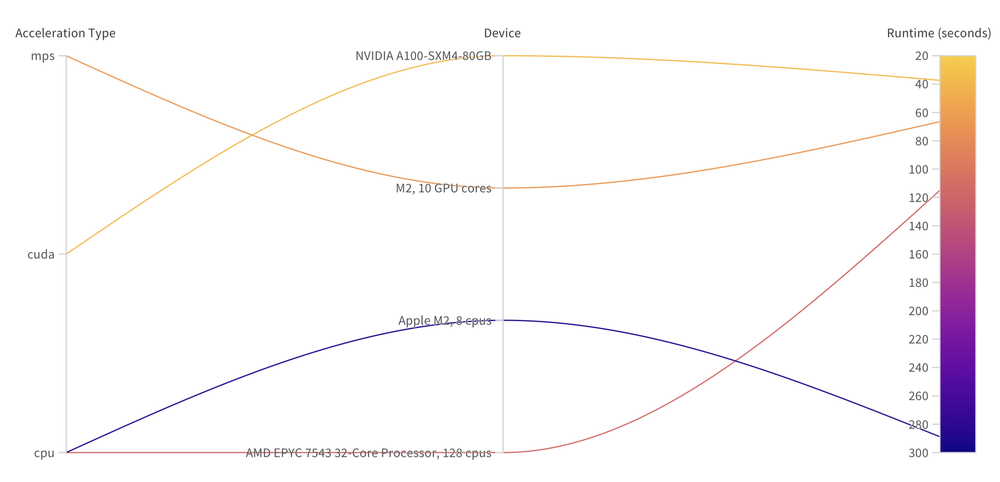

# A Toy PyTorch Benchmark

## Overview

This is a toy PyTorch benchmark project created using CLAIRE's
[Python Machine Learning Project Template]( https://github.com/CLAIRE-Labo/python-ml-research-template/tree/main).


_Runtime with different devices training a CNN on MNIST. Check `reproducibility-scripts/runtime-benchmark.yaml` to reproduce. See curves on [Weights&Biases](https://wandb.ai/claire-labo/pytoych-benchmark)_

It is meant to show how a project started from the template looks like.
Most of the following README and the instructions to set the environment were generated by the template.

## Getting Started

### Code and development environment

We support the following methods and platforms for installing the project dependencies and running the code.

- **Docker/OCI-container for AMD64 machines (+ NVIDIA GPUs)**:
  This option works for machines with AMD64 CPUs and NVIDIA GPUs.
  E.g. Linux machines (EPFL HaaS servers, VMs on cloud providers),
  Windows machines with WSL, and clusters running OCI-compliant containers,
  like the EPFL Run:ai (Kubernetes) clusters.

  Follow the instructions in `installation/docker-amd64-cuda/README.md` to install the environment
  then get back here for the rest of the instructions to run the experiments.

  We ran our experiments on an 80GB NVIDIA A100 GPU and AMD EPYC 7543 CPUs.

- **Conda for osx-arm64**
  This option works for macOS machines with Apple Silicon and can leverage MPS acceleration.

  Follow the instructions in `installation/conda-osx-arm64-mps/README.md` to install the environment
  then get back here for the rest of the instructions to run the experiments.

  We ran our experiments on an Apple M2 MacBook Air with 10 GPU cores and 24GB of memory.

### Data

Refer to `data/README.md`.

### Logging and tracking experiments

We use [Weights & Biases](https://wandb.ai/site) to log and track our experiments.
If you're logged in, your default entity will be used (a fixed entity is not set in the config),
and you can set another entity with the `WANDB_ENTITY` environment variable.
Otherwise, the runs will be anonymous (you don't need to be logged in).

## Reproduction and Experimentation

### Reproducing our results

We provide scripts to reproduce our work in the `reproducibility-scripts/` directory.
It has a README at its root describing which scripts reproduce which experiments.

### Experiment with different configurations

The default configuration for each script is stored in the `configs/` directory.
They are managed by [Hydra](https://hydra.cc/docs/intro/).
You can experiment with different configurations by passing the relevant arguments.
You can get examples of how to do so in the `reproducibility-scripts/` directory.

### Using trained models and experimenting with results

We share our Weights and Biases runs in [this W&B project](https://wandb.ai/claire-labo/pytoych-benchmark).

Moreover, we make our trained models available.
You can follow the instructions in `outputs/README.md` to download and use them.

## Repository structure

Below, we give a description of the main files and directories in this repository.

```
 └─── src/                         # Source code.
    └── pytoych_benchmark          # Our package.
        ├── configs/               # Hydra configuration files.
        ├── models/mnist.py        # A CNN model for MNIST.
        ├── mnist.py               # Trains and evaluates a model on MNIST.
        └── template_experiment.py # A template experiment.
```

## Contributing

We use [`pre-commit`](https://pre-commit.com) hooks to ensure high-quality code.
Make sure it's installed on the system where you're developing
(it is in the dependencies of the project, but you may be editing the code from outside the development environment.
If you have conda you can install it in your base environment, otherwise, you can install it with `brew`).
Install the pre-commit hooks with

```bash
# When in the PROJECT_ROOT.
pre-commit install --install-hooks
```

Then every time you commit, the pre-commit hooks will be triggered.
You can also trigger them manually with:

```bash
pre-commit run --all-files
```
